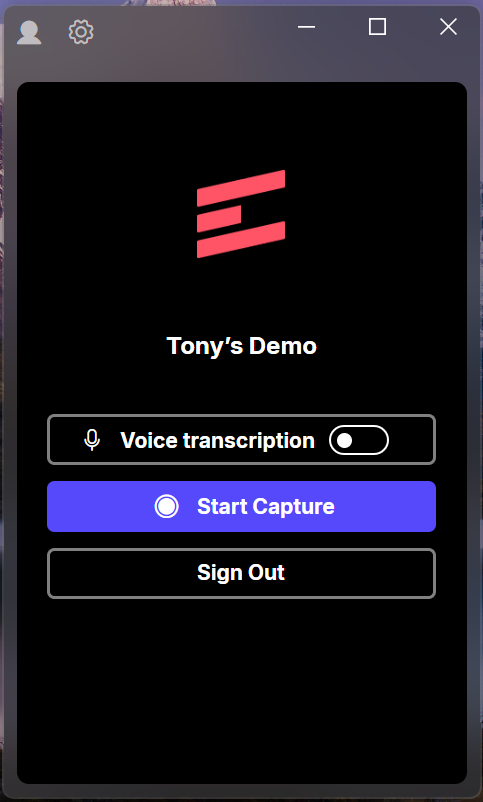
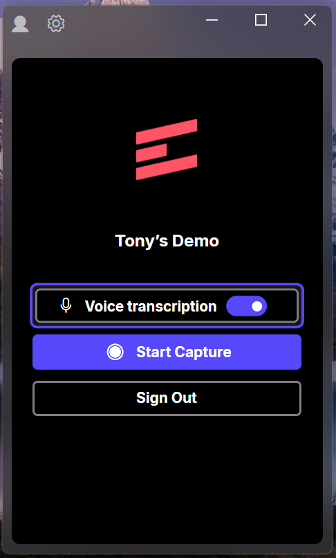
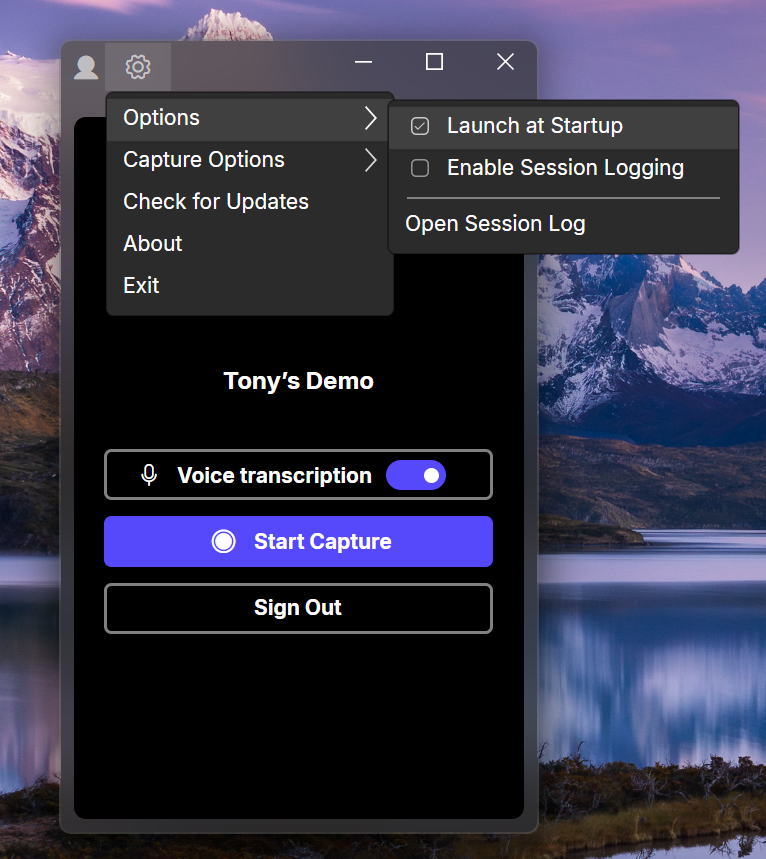

# 🎥 CaptureTool

**CaptureTool** is a windows (cross-platform planned) desktop application built with Avalonia UI that records screen and audio, transcribes speech, and outputs a final video with optional subtitles — inspired by the functionality of [Scribe](https://scribehow.com/).

This project is currently in progress as a technical showcase for an interview. he core capture functionality is now complete — screen and audio can be recorded in sync, sent for transcription via OpenAI's Whisper API, and muxed into a single subtitle-burned video output using FFmpeg. While the capture pipeline is fully functional, I'm planning for additional polish and features to expand my experience:
- Audio input device selection
- Screen/window selection improvements
- Performance tuning for muxing (potentially replacing FFmpeg with more native libraries)
- UX enhancements (logging, keyboard input tracking, click visualization, etc.)

---

## ✨ Features (Planned + In Progress)

| Feature                        | Status      |
|-------------------------------|-------------|
| Modern styled UI (Scribe-like) | ✅ Done      |
| Custom-themed buttons & toggles | ✅ Done      |
| Application settings (DI + JSON persistence) | ✅ Done      |
| Menu system w/ nested options | ✅ Done      |
| Screen recording service       | ✅ Done  |
| Audio recording service        | ✅ Done  |
| Transcription service (Whisper integration) | ✅ Done    |
| Muxing service (video + audio + optional subtitles) | ✅ Done    |
| Session-based folder output (timestamped) | ✅ Done |
| Screen selection | ✅ Done |
| Test and refactor for cross-platform functionality | 🔲 Planned    |
| Audio device selection | 🔲 Planned    |
| Logging service ( Serilog or NLog ) | 🔲 Planned    |
| Refactor/explore with native windows media APIs for performance (NAudio, WinRT,  etc.) | 🔲 Planned    |


---

## 🧩 Architecture Overview

CaptureTool is designed around clean separation of concerns and SOLID principles. The app is composed of the following services:

### `ICaptureService`
High-level orchestrator that coordinates audio, screen, transcription, and muxing workflows.

### `IScreenRecordService`
Responsible for screen capture using configurable inputs (e.g., screen index, resolution, framerate | currently uses main desktop).

### `IAudioRecordService`
Handles audio capture from a selected input device. (currently uses default)

### `ITranscriptionService`
Processes recorded audio through Whisper or other engines to generate `.srt` and `.txt` transcripts.

### `IMuxingService`
Combines audio, video, and optionally hardcoded subtitles into a final `.mp4` file.

### `ISettingsService`
Manages persistent application settings using a local JSON file:
```
C:\ProgramData\CaptureTool\appsettings.json
```

---

## 💡 Design Goals

- ✅ **Cross-platform (Windows/macOS)** via Avalonia UI
- ✅ **Dependency Injection** via `Microsoft.Extensions.DependencyInjection`
- ✅ **MVVM Architecture** with `CommunityToolkit.Mvvm`
- ✅ **Modular & extensible** service-based design
- ✅ **Scalable for future features** like subtitle overlay, cloud transcription, and export presets

---

## 📂 Example Directory Layout

Each recording creates a new folder under the user’s capture directory:

```
~/Videos/CaptureTool/Captures/2024-04-21_12-32-15/
├── screen.mp4
├── audio.wav
├── transcript.srt
├── transcript.txt
└── final_output.mp4
```

---

## 🛠️ Tech Stack

- **UI:** [Avalonia UI](https://avaloniaui.net/)
- **MVVM:** CommunityToolkit.Mvvm
- **DI:** Microsoft.Extensions.DependencyInjection
- **Serialization:** System.Text.Json
- **Recording (planned):** FFmpeg

---

## 🚧 Current Status

> The main window UI and application structure is implemented. Service interfaces are defined. Recording and Audio services are implemented with hard-coded configuration. Transcription service is completed using an API call to Whisper - needs to be supplied a path to an OpenAI api key.

You can check progress and services inside the [`Services`](./source/CaptureTool/Services) directory.

---

## 🗺️ Roadmap

- [x] Implement `ScreenRecordService` using FFmpeg
- [x] Implement `AudioRecordService` using FFmpeg
- [ ] Add basic `TranscriptionService` using Whisper
- [ ] Add muxing pipeline to stitch audio + video + subtitles
- [ ] Add start/stop recording logic via `CaptureService`
- [ ] Implement audio device selection
- [ ] Implement screen or app selection
- [ ] Implement logging

---

## 📸 Screenshots
<p float="left">





</p>

---

## 🧠 Advanced Ideas + AI Considerations

As I kept thinking about how to develop this tool beyond a simple screen capture, I started thinking about intelligent behavior like what's seen in Scribe and how it's accomplished, as well as how I could improve on it (if not done already). I plan on implementing some of these, others are still just food for thought:

#### 🔘 Input Tracking
- [ ] **Mouse Click Overlays**: Visually show mouse clicks in the final video for clarity.
- [ ] **Event Logging**: Log each click and keystroke with timestamp and coordinates.
- [ ] **Region Snapshots**: Capture a screenshot of the region around a click and timestamp for documentation.

#### 🧠 Smart Action Detection with AI/Heuristics
- [ ] **Click Filtering**: Use heuristics or ML to distinguish meaningful clicks from background noise.
- [ ] **Short Clips for AI**: Instead of sending the whole video to an AI model, extract 1–2 second snippets around key events to minimize processing time and data.
- [ ] **Computer Vision + Accessibility**: Combine computer vision (screenshot differences) with native accessibility APIs to interpret the UI — this could help identify actions like "opened dropdown" or "clicked toolbar" since a browser-like DOM isn't available
- [ ] **Contextual Heuristics**:
  - Example 1: If a click occurs near a button and within 500ms a modal or overlay appears, infer a "Launched Modal" action.
  - Example 2: If a user clicks a hamburger menu icon and new items appear in a left-hand region, infer "Expanded Navigation Menu".

---

## 🧠 Why I Built This

This project started as a reverse-engineered replica of the Scribe desktop app — but quickly turned into something more.

I built this because:
- I love figuring out how things work, and I wanted to push my UI skills by recreating Scribe's visuals and behavior from scratch
- I wanted to architect something modular, cross-platform, and built to scale — not just a one-off demo
- I learn best by doing. Styling buttons, building toggle switches, retemplating checkboxes are things I hadn’t done before this project, but figured it out through documentation, GitHub digging, tutorials, and lots of experimentation
- I like challenges, especially when it really piques my curiosity. I didn’t have the Scribe source code, but I wanted to prove I could replicate the experience

---

⭐ If you're reviewing this for a technical interview — thank you!
